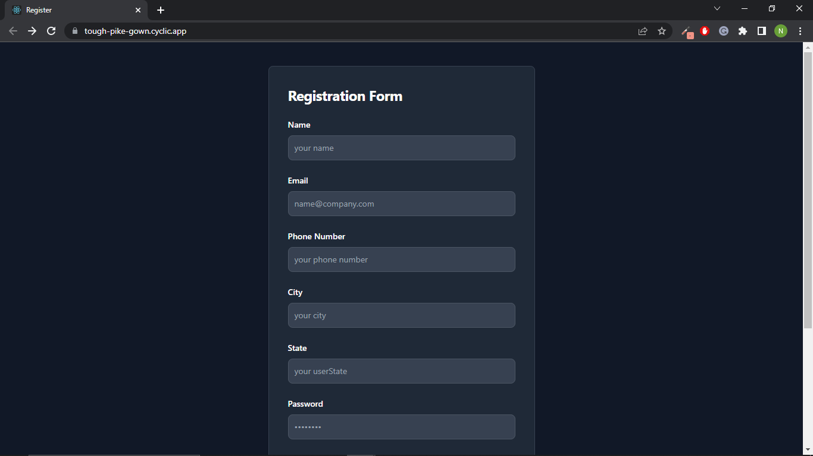
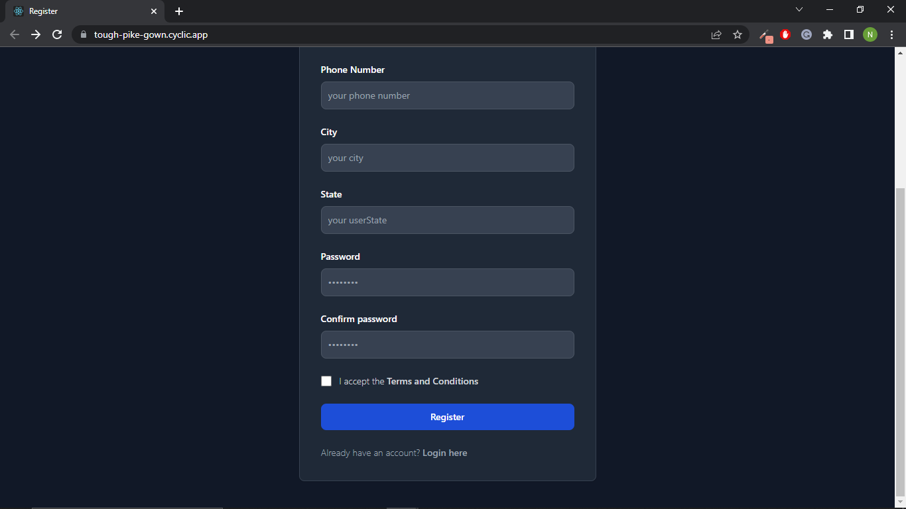
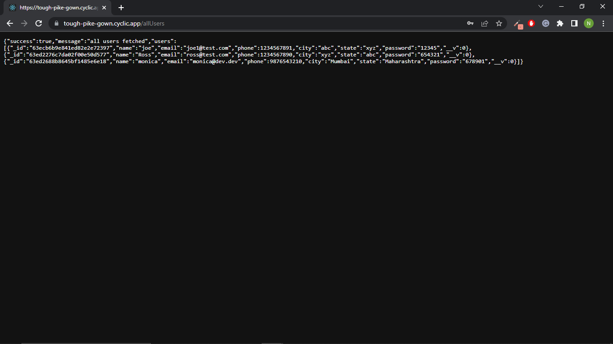

# Registration Form

### Tech Stack Used:
Frontend: React JS, Tailwind CSS

Backend: Node JS, Express JS

Database: MongoDB

Deployed Link: [Registration Form](https://tough-pike-gown.cyclic.app/)

End point to look at all the users who filled the form: [All Users](https://tough-pike-gown.cyclic.app/allUsers)

# Outputs

## Form

## All Users

Made with ❤️ by Nisarg Shah
